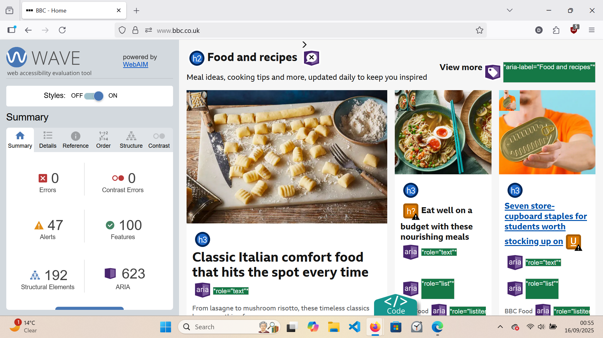
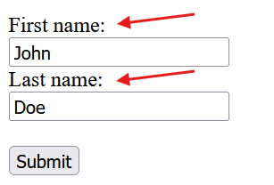
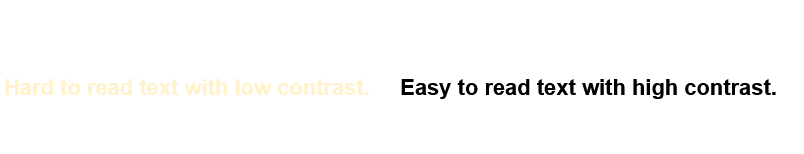

A fun fact about me is that one of my favourite websites for accessibility is the [BBC](https://www.bbc.co.uk/aboutthebbc). I remember mentioning this in conversation at a time where I was learning how to audit websites and to look out for ways in which they may or may not pass accessibility requirements. 

*“Well, obviously. It needs to be.”* was the response when I mentioned it, which to be fair seems pretty evident when you think about it. As a public service broadcaster with a worldwide audience, it is necessary to ensure the news is accessible to everyone.

But then when you really *really* think about it, [Apple](https://en.wikipedia.org/wiki/Apple_Inc.) - another example of a website with a great accessibility score, is a company that doesn't carry the same obligations as the BBC. So I guess the question here is, what motivates companies like Apple to prioritise accessibility when they don't face the same public service requirements? Why is it obvious for one, but not for the other? 

Following this thread of thought, it becomes clear why I rarely find websites with scores as good as the BBC or Apple’s, and why single digit error counts will get an impressed ‘hmm’ from me. Simply put, it comes full circle on how we [rethink accessibility](https://www.skiptocontent.co.uk/blog/post-2/post-2). 

How do I know their scores, you ask? Enter WAVE, a tool that assesses a website, and provides a summary of elements on that website that are conflicting with accessibility requirements. It’s a browser extension you add to your browser, that with one click evaluates the web page you are visiting. If you feel savvy enough, I recommend downloading and giving it a try!

 

Errors can range from a missing form label - which means that the code for a form that you fill out, doesn't have a label for a section, which can be detrimental for people who rely upon screen readers to fill in the correct information, 

*In the image the red arrows point to form labels.*

to contrasting colour errors - where the colours chosen by the website will affect all users, especially those with visual impairments. 

Surfing the web with WAVE has truly been an insightful learning experience. It’s a great tool for gaining insight into where websites have overlooked accessibility features and how they can rectify these oversights. 

What started as admiration for the BBC and Apple’s accessibility score has transformed into looking for where we can apply [curb cut](https://en.wikipedia.org/wiki/Curb_cut_effect) thinking to everyone’s web experiences. Often, it’s a simple line of code that can be implemented that can make such a huge difference! 

