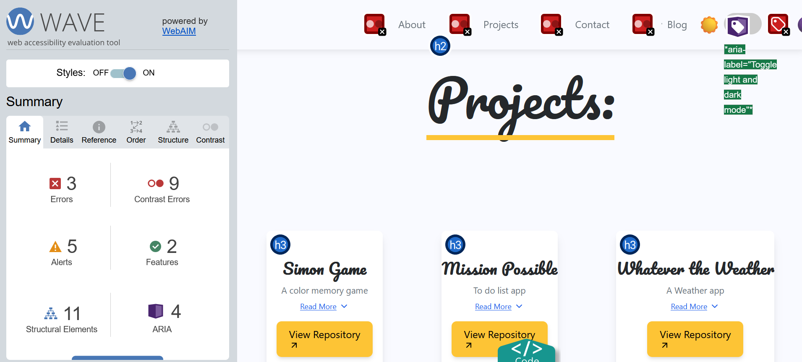
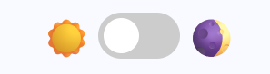
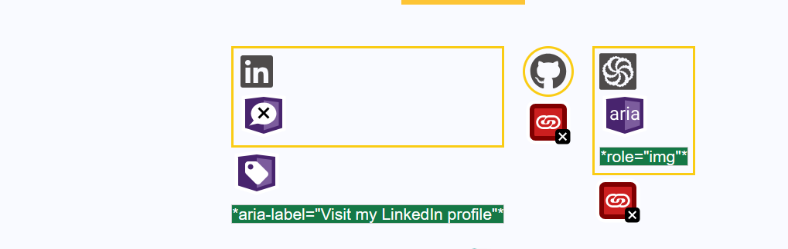
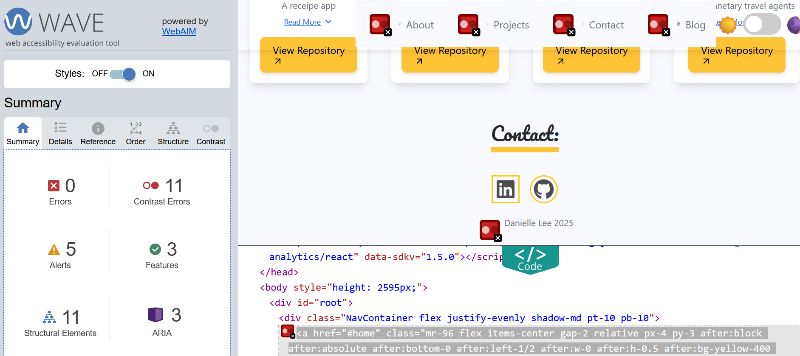

Starting at the beginning is famously a very good place to start (Maria Von Trapp said it herself in the sound of music). So when it comes to checking requirements for my projects, I've found starting with the basics really helps to build a solid foundation of compliance in my code. In my previous post, I expressed how using [WAVE](https://wave.webaim.org/) has been instrumental in highlighting the places in code where there may be overlooked opportunities for accessibility.

However, it's one thing to use WAVE, but another to actually implement the changes to get that error score down to a single figure (preferably zero). So in the spirit of transparency, let's play a game I like to call, Auditing the Auditor! And take a look at my own portfolio site that I built and its WAVE score. Any guesses on what I scored? 

 
*WAVE being used on my portfolio website.*

If you’d said three errors with nine contrasting errors you’d be correct! And someone who clearly used the WAVE extension on my page (Go you!). In all honesty I was pleasantly surprised at my result. Accessibility can often feel overwhelming, but at the risk of sounding like a parrot, sticking to the basics was how I achieved such a low score. My errors were mostly oversights where I’d forgot to add a small line of code (whoops). 

So what were the three errors? The first error was due to an empty form label missing from the dark mode toggle switch, located at the top right hand corner of the page. Though it can be confusing as to why a toggle switch is being considered a form, this was a great example of how WAVE can flag issues that might have been missed in initial checks. 

The toggle switch that changes the page from a light to a dark theme uses the same code as a checkbox form, which has then been visually transformed to look like a toggle. Under the hood, it is the same as saying: “Do you want the lights on or off? Check Yes for lights on or Check No for lights off.” To the user, this is presented as a toggle instead. 

 
*Toggle Switch*

The next two errors were due to empty links. This initially confused me as how can a link be considered empty? Links were provided to each respective website’s logo, i.e. if you click the LinkedIn icon, it takes you to my LinkedIn page, with the same applying to the GitHub and Codewars logos. 

 
*Logos that link to their respective site.*

My interpretation was wrong. It didn’t mean that links weren’t available, but that they were not being labelled with their purpose. The question being asked wasn't *where was the link?*, but instead: *what did the link do?*

The more eagle-eyed readers will see that LinkedIn doesn't flag the same errors as the other two logos. Why? This is due to the [aria-label](https://www.w3schools.com/accessibility/accessibility_labels.php) which says “visit my LinkedIn profile.” Having an aria-label for the LinkedIn logo meant that it passed accessibility checks for screen-readers, and clearly stated what the logo was responsible for - an oversight I'd missed for the other two logos. 


The fix for all the three errors? Adding screen-reader only text using:  

```
 <span className="sr-only">Hidden text goes here</span> 

 ```

This code adds text that will be hidden visually but readable by screen readers. The ‘sr-only’ class (think of this as a name tag) tells the browser to keep it accessible to assistive technology while hiding it from visual display. 

- For the dark mode toggle the text would read ‘Toggle dark mode’
- For GitHub: ‘Visit my GitHub profile’
- For Codewars: ‘Visit my Codewars profile’

And so, after applying this line my score goes down to a nice zero:

 
*WAVE showing new score*

Interestingly, while my main errors dropped to zero, I noticed that the contrast errors increased. Another easy fix to tackle. Though WAVE does have the ability to suggest colour values, I prefer using another tool: [ColorShark](https://colorshark.io/).  Using a scale of A, AA, and AAA (with AAA being the top level of [WCAG](https://www.w3.org/WAI/standards-guidelines/wcag/) compliance), ColorShark helps to quickly visualise hue, saturation and lightness, invert the background and foreground colours, but also more importantly test colours against colour blindness conditions. 

After doing some digging, my colour palette for my paragraphs and headers were too light, and didn't provide enough contrast against the background. By simply adding the tailwind class (a styling framework that provides pre-built designs) of `text-gray-700` to make my text darker, my contrast score dropped to two - the two being for a span element that won't actually be seen on the page.  

Getting down to a low score using WAVE was an experience in how just taking a little extra time and consideration can have a much greater impact than the small amount of code required. Each fix, no matter how easy or small, has helped to create a page that more people can access comfortably. Accessibility isn't about getting it right on the first try, but is instead being open to refining the small fixes where necessary. Here's hoping that playing auditing the auditor catches on. 
