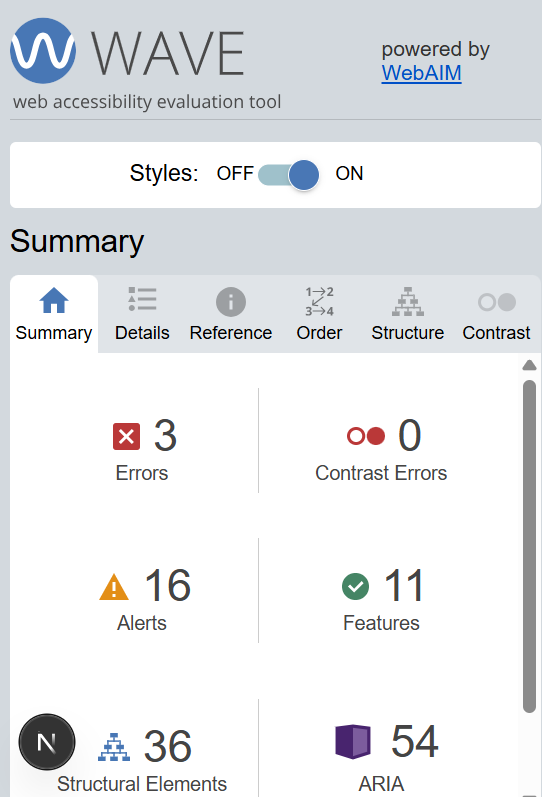

A hard truth I’ve had to accept as I audit accessibility is that there is no such thing as a perfect score. In my last post I worked to get all my errors down to zero, but the true reality of accessibility is that it's not just about numbers.

Fixing critical errors should always be a priority especially as it can really improve user experience, and it's WAVE’s goal to not only highlight critical errors, but accessibility issues to be *evaluated in context*.

This is where alerts come to play. WAVE alerts warn you of areas of concern on your webpage that may be an issue for accessibility, but needs developer discretion as to how much of an impact it will have - especially important for a website that is a lot more in-depth than my own portfolio page.

Enter Vsphera, a website that helps to streamline the collaborative writing of STEM grant applications. And as an intern at Vsphera, and self-professed accessibility auditor, I audited our website.

 

*Vsphera WAVE score.*

Scoring a low score of three errors and zero contrasting errors meant that Vsphera were laying great accessibility foundations. In fact the three errors that were flagged by WAVE were very similar to the ones I had within my own website, and what I suspect may also affect many other websites. 

Without going into too much detail, the errors that needed immediate attention were issues with: 

- [aria-labels](https://developer.mozilla.org/en-US/docs/Web/Accessibility/ARIA/Reference/Attributes/aria-label) and making sure they were correctly referenced the current section of the website for accessibility tech (similar to having descriptive chapters of a book).

- alternative text for images that needed to be clarified to screen readers as decorative (this helps screen readers to avoid repetitive or unnecessary descriptions that can lengthen their journey). 

- improving alternative text description for logos (clarifying the purpose of the logo i.e. search logo, company logo etc).

However when it came to alerts, WAVE flagged sixteen areas which needed attention. Admittedly this is where I was left a little confused. If alerts are cause for concern, why weren't they promoted to being an error? It wasn't until I began working my way through alerts that I realised why. 

Now to go back a couple blog posts, I’m sure it's no secret as to how much I love closed captioning. So when one of our alerts flagged the use of a video on our website and warned us to use captions to improve accessibility, I was excited to play transcriber! And I would have realised said dreams if the same video actually had any audio. 

So how do you add captioning to a video with no audio description? The simple answer is you can't, but it doesn't stop WAVE from alerting you what it feels is a possible opportunity to fix accessibility. Instead the next best thing is to improve the accessibility around it, but to ultimately accept the alert as is. 

Using [aria-describedby](https://developer.mozilla.org/en-US/docs/Web/Accessibility/ARIA/Reference/Attributes/aria-describedby) was the solution to this problem. Similar to aria-labels the difference between them is: 

> *A label describes the essence of an object, while a description provides more information that the user might need.*
>
> MDN docs
>

So instead of labelling my video as 'a video', I had to describe the content / type of video on the webpage and justify why it didn't need captioning for screen readers. 

In my research before this solution I did learn that usually when it comes to captioning a video, you have to use a [webVTT file](https://developer.mozilla.org/en-US/docs/Web/API/WebVTT_API/Web_Video_Text_Tracks_Format) to store the video captions. This file then gets linked back to the video where both are combined and subtitles accompany the audio. In this case, as there is no transcription needed, there is no caption source for the video so the link is never created and remains empty, relying on the aria-describedby description. 

The next set of alerts fell under the umbrella of styling, and was an important reminder of HTML basics. As screen readers rely on the hierarchy of [heading elements](https://www.w3schools.com/html/html_headings.asp) to know the importance of the webpage content (the bigger the heading, the more important it is), having text that is larger than the heading will get flagged as confusing. This is what happened with paragraphs that were styled to be visually dominant. The fix? Using [aria-labelledby](https://developer.mozilla.org/en-US/docs/Web/Accessibility/ARIA/Reference/Attributes/aria-labelledby) to link the intentionally larger paragraph to its corresponding heading. What this says to a screen reader is *‘this paragraph belongs to this heading, despite the fact that it's larger.’*

The final alert came from a potential redundant link detected. As both our logo and *‘Home’* button used the same link to redirect users to the homepage, this repetition was enough for WAVE to deem it a cause for concern. However both are necessary for navigation across other devices i.e. mobile devices. Sure both logo and button do the same job, but that job is dependent on the context in which they work. Due to this, accepting this alert was necessary to keep functionality and highlighted how sometimes alerts can mean well but actually hinder accessibility. 

Focusing on the context of issues as opposed to the number of issues changed how I viewed accessibility. Though it was frustrating not to solve every alert, providing context and justification really built upon my skill of taking a step back and looking at the bigger picture. Providing descriptions and establishing relationships between code to be clearer to screen readers still adds something, even though it doesn't remove WAVE’s critical eye.  
